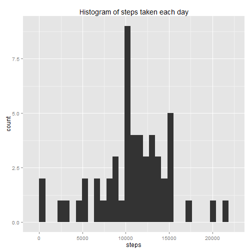
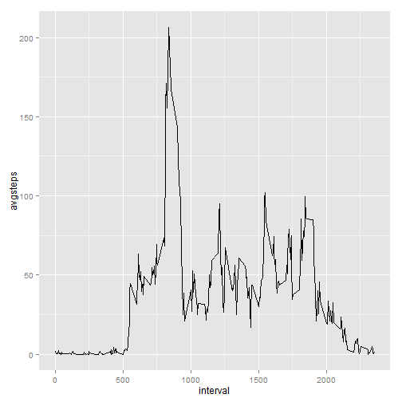
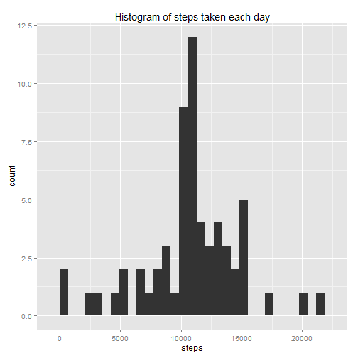

Peer Assessment 1
===================================================

**-First I download the file (date downloaded: 04/06/2014):**

```r
Sys.setlocale("LC_TIME", "C")
```

```
## [1] "C"
```

```r
download.file("http://d396qusza40orc.cloudfront.net/repdata%2Fdata%2Factivity.zip", "data.zip")
```

*Unzipping and reading in:*


```r
con <- unz('data.zip', 'activity.csv')
open(con)
data <- read.csv(con, header=T)
close(con)
```

**Calculating the sum of steps taken each day:**


```r
steps <- tapply(data$steps, data$date, sum)
x <- as.data.frame(cbind(unique(as.character(data$date)), steps))
names(x) <- c('date', 'steps')
x$date<-strptime(x$date, format="%Y-%m-%d")
x$steps <- as.numeric(as.character(x$steps))
```

**Plotting steps:**


```r
library(ggplot2)
qplot(steps, data=x, main="Histogram of steps taken each day")
```

```
## stat_bin: binwidth defaulted to range/30. Use 'binwidth = x' to adjust this.
```

 

**Reporting the mean and median of steps taken each day:**


```r
mean(x$steps, na.rm=T)
```

```
## [1] 10766
```

```r
median(x$steps, na.rm=T)
```

```
## [1] 10765
```

**Creating a dataframe containing the averaged steps in every interval throughout the days:**


```r
y <- as.data.frame(cbind(unique(data$interval), tapply(data$steps, data$interval, mean, na.rm=T)))
names(y) <- c('interval', 'avgsteps')
```

**Plotting the time-series plot:**


```r
library(ggplot2)
qplot(interval, avgsteps, data=y, geom='line')
```

 
Reporting the time interval with highest average steps taken: 


```r
y[grep(max(y$avgsteps), y$avgsteps),]
```

```
##     interval avgsteps
## 835      835    206.2
```

**Imputing missing values:**  
*Reporting number of missing values:*

```r
length(data$steps[is.na(data$steps)==T])
```

```
## [1] 2304
```

*Creating new data set with the missing values exchanged for the average of the corresponding 5-minute interval across the experiment:*


```r
isna <- is.na(data$steps)
for(i in 1:length(isna)){
if (isna[i]==T){
  z <- data[i, 3]
  ssz <- which(y$interval==z)
  data[i, 1] <- y[ssz, 2]
}
}
```

*Calculating the sum of steps taken each day with the new data set:*


```r
steps <- tapply(data$steps, data$date, sum)
x <- as.data.frame(cbind(unique(as.character(data$date)), steps))
names(x) <- c('date', 'steps')
x$date<-strptime(x$date, format="%Y-%m-%d")
x$steps <- as.numeric(as.character(x$steps))
```

*Plotting steps in new data frame with NAs eliminated:*


```r
library(ggplot2)
qplot(steps, data=x, main="Histogram of steps taken each day")
```

```
## stat_bin: binwidth defaulted to range/30. Use 'binwidth = x' to adjust this.
```

 

*Reporting the mean and median of steps taken each day for the new data frame:*


```r
mean(x$steps, na.rm=T)
```

```
## [1] 10766
```

```r
median(x$steps, na.rm=T)
```

```
## [1] 10766
```
Determining weekdays and weekends:

```r
data$date <- strptime(data$date, "%Y-%m-%d")
data$days <- weekdays(data$date)
data$days <- gsub("Saturday", "weekend", data$days)
data$days <- gsub("Sunday", "weekend", data$days)
for(i in 1:length(data$days)) {
  if(data$days[i]!="weekend") data$days[i] <- "weekday"
}
```

Calculating average number of steps for weekdays:


```r
newdata <- split(data, data$days)
weekday <- as.data.frame(newdata[1])
x<-tapply(weekday$weekday.steps, weekday$weekday.interval, mean)
weekdayavg<- as.data.frame(cbind(x, unique(weekday$weekday.interval)))
weekdayavg$days <- "weekday"
names(weekdayavg) <- c("avgsteps", "interval", "days")
```

Calculating average number of steps for weekends:


```r
weekend <- as.data.frame(newdata[2])
x<-tapply(weekend$weekend.steps, weekend$weekend.interval, mean)
weekendavg<- as.data.frame(cbind(x, unique(weekend$weekend.interval)))
weekendavg$days <- "weekend"
names(weekendavg) <- c("avgsteps", "interval", "days")
```

Combining data frames:

```r
stepsavg <- rbind(weekdayavg, weekendavg)
```
Plotting activity by weekdays:


```r
qplot(interval, avgsteps, data=stepsavg, geom="line", facets=days~.)
```

 
